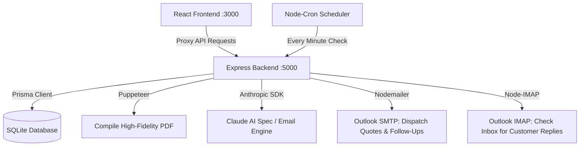

# 📋 Kuchhal Brothers Quotation Generator & Sales Outreach Pipeline

An enterprise-grade B2B quotation manager and sales outreach automation platform designed for high-fidelity technical proposals, custom product image synthesis, and automated follow-ups. Built using a modern full-stack TypeScript architecture, it features a pixel-perfect PDF rendering engine and intelligent CRM automation powered by the Anthropic Claude AI SDK.

---

## 🚀 Key Features

### 1. High-Fidelity B2B Quotation Editor
*   **Comprehensive Details:** Input fields for Billing and Shipping addresses (with state/GST codes), transport methods, payment terms, delivery parameters, and warranties.
*   **Product Image Attachments:** Attach high-resolution images (via Base64) to individual item descriptions to compile visually complete technical catalogs.
*   **Composite Quotation Toggle:** Easily switch to a consolidated, bundled "Composite" layout that groups item descriptions and summarizes pricing into an elegant enterprise format.
*   **Branding & Signatures:** Upload company logos and authorized signatures to customize PDF outputs instantly.

### 2. Intelligent CRM & Sales Follow-Up Pipeline
*   **Instant Dispatch:** Saving a quotation triggers server-side validation, PDF compilation, and an initial email delivery via Outlook SMTP (`nodemailer`).
*   **Automated Outreach Scheduler:** Registers a follow-up sequence tracking state (`ACTIVE`, `STOPPED`, `COMPLETED`).
*   **Active IMAP Reply Listener:** A periodic cron job (`node-cron` + `node-imap`) checks the Outlook mailbox for customer replies.
*   **Auto-Stop Safety Lock:** If the customer replies, the system immediately switches the sequence to `STOPPED`, ensuring sales reps handle conversations manually and avoiding awkward double-messaging.
*   **Interactive Tracker Panel:** A side-over drawer in the frontend UI to visualize active sequences, trigger outreach check runs manually, delete sequences, or manually mark client replies.

### 3. Smart B2B AI Assistant (Anthropic Claude)
*   **Technical Spec Synthesizer:** Instantly draft highly detailed technical specifications for product items simply by specifying the product name.
*   **Persuasive Outreach Drafter:** Generate custom, context-aware introductory email templates pulling directly from the quote's values, delivery terms, and warranties.
*   **Adaptive Follow-Up Copywriting:** Crafts consecutive follow-up emails that dynamically change tone based on sequence count (e.g. Follow-Up 1, 2, or 3) and total quotation value.

### 4. Enterprise PDF Rendering Engine
*   **Puppeteer Backend:** Executes a headless Chromium browser instance to compile high-fidelity HTML and custom CSS templates with standard yellow-accent styling directly into binary PDF streams.

---

## 🛠️ Architecture & Technology Stack



### Frontend Stack
*   **React (v18) + Vite + TypeScript** for a modular and ultra-fast SPA.
*   **Tailwind CSS** for premium industrial-grade layouts, custom yellow borders, and interactive dark-tinted drawers.
*   **Zustand** for lightweight, centralized state management.
*   **Lucide React** for smooth vector iconography.

### Backend Stack
*   **Node.js + Express + TypeScript** secure REST API server.
*   **Prisma ORM + SQLite** for robust local database management.
*   **Puppeteer** for server-side HTML-to-PDF rendering.
*   **Anthropic Claude SDK** for intelligence and B2B email generation.
*   **Nodemailer & Node-IMAP** for dual-channel email communications.
*   **Node-Cron** for automation scheduling.

---

## 📂 Repository Structure

```
📂 Quotation Generator
├── 📂 frontend
│   ├── 📂 src
│   │   ├── 📂 api          # Backend API services (Zustand-connected fetch clients)
│   │   ├── 📂 components   # Reusable UI components (ai, layout, quotation)
│   │   ├── 📂 pages        # QuotationEditor page (Form & live CSS template preview)
│   │   ├── 📂 store        # Zustand quotationStore.ts (State management & presets)
│   │   ├── 📂 types        # TypeScript definitions
│   │   └── 📂 utils        # High-fidelity HTML templates
│   ├── vite.config.ts      # Vite config with /api proxy to :5000
│   └── package.json
├── 📂 backend
│   ├── 📂 prisma           # SQLite dev.db and schema.prisma
│   ├── 📂 src
│   │   ├── 📂 database     # Prisma database client
│   │   ├── 📂 jobs         # Chronometer tasks (followUpCron.ts check loops)
│   │   ├── 📂 pdf          # Puppeteer template setups
│   │   ├── 📂 routes       # Express secure routers (quotationRouter, aiRouter)
│   │   ├── 📂 services     # Service layers (emailService, aiService, pdfService)
│   │   └── app.ts          # Server entry point
│   ├── .env.example        # Environment variables configuration template
│   └── package.json
└── package.json            # Root workspace config
```

---

## 💾 Database Schema

The database model is defined via Prisma (in `backend/prisma/schema.prisma`):

| Model | Description | Key Fields |
| :--- | :--- | :--- |
| **Customer** | Stored customer data, automatically resolved by name | `id`, `name`, `email`, `phone`, `gstin`, `address` |
| **Quotation** | Complete historical records and configuration details | `id`, `quoteNumber`, `quoteDate`, `validTill`, `subtotal`, `tax`, `total`, `isDocComposite`, `status` |
| **QuotationItem** | Individual lines tied to a specific quotation | `id`, `description`, `hsn`, `qty`, `rate`, `tax`, `photo` (Base64) |
| **FollowUpSequence** | Pipeline engine state to monitor B2B follow-ups | `id`, `customerEmail`, `status` (ACTIVE/STOPPED/COMPLETED), `followUpCount`, `nextFollowUpDate` |

---

## ⚙️ Installation & Configuration

### 1. Prerequisites
Ensure you have **Node.js** (v18+) and **npm** installed on your system.

### 2. Configure Environment Variables
Navigate to the `backend/` directory, create a `.env` file, and populate the details based on `.env.example`:

```bash
cd backend
cp .env.example .env
```

Define the variables:
```ini
PORT=5000
DATABASE_URL="file:./dev.db"
ANTHROPIC_API_KEY="your-claude-api-key"

# Outlook Integration (SMTP & IMAP)
OUTLOOK_EMAIL="your-sales-email@outlook.com"
OUTLOOK_APP_PASSWORD="your-secure-app-password"
```
> ⚠️ **Important:** If your Outlook account has Two-Factor Authentication (2FA) enabled, you **must** generate an "App Password" from your Microsoft Account security portal rather than using your standard password.

---

## 🏃 Running the Application

Follow these steps to run both the backend and frontend in development mode.

### 🖥️ Step A: Initialize the Backend
1. Navigate to the backend directory:
   ```bash
   cd backend
   ```
2. Install the backend dependencies:
   ```bash
   npm install
   ```
3. Prepare the SQLite database structure using Prisma:
   ```bash
   npm run prisma:generate
   npm run prisma:push
   ```
4. Boot the Express API server (runs on `http://localhost:5000` via nodemon):
   ```bash
   npm run dev
   ```

### 🎨 Step B: Initialize the Frontend
1. Open a new terminal window and navigate to the frontend directory:
   ```bash
   cd frontend
   ```
2. Install the frontend dependencies:
   ```bash
   npm install
   ```
3. Start the Vite development server (runs on `http://localhost:3000`):
   ```bash
   npm run dev
   ```
4. Access the web interface in your browser at `http://localhost:3000`.

---

## 📧 How the Follow-Up Sequence Works

1. **Trigger:** When creating a quotation, if a **Billing Email** is supplied, the backend sends the compiled PDF directly to the client and automatically registers a new `FollowUpSequence` set to `ACTIVE`.
2. **First Delay:** By default, the first follow-up is scheduled **1 hour** later (for testing and quick reviews). You can adjust this to **24 hours** in `quotationRoutes.ts` (Line 216).
3. **Automated Scheduler:** The cron job runs every minute. It checks the Outlook IMAP mailbox to see if the customer has replied.
    *   **If a reply is detected:** The sequence status immediately switches to `STOPPED`.
    *   **If no reply is detected and the due date has passed:** The backend requests Anthropic Claude to compile the next B2B email message (customized to the previous count, value, and client terms). The email is dispatched, the `followUpCount` increments, and `nextFollowUpDate` is set to +1 hour.
4. **Max Outreach Cap:** Once a sequence registers more than **3 automated follow-ups** without response, the system marks the sequence as `COMPLETED` and halts further emails to maintain brand professionalism.

---

## 🔧 Troubleshooting & Tips

### ❌ Port 5000 already in use
If the backend throws `EADDRINUSE` on port `5000`, run this command in **PowerShell** to quickly terminate old Node processes occupying the port:
```powershell
Get-Process -Name node | Stop-Process -Force
```

### 📧 Skip IMAP testing in local environments
If you leave `OUTLOOK_APP_PASSWORD` blank or commented out in your `.env` file, the backend will automatically bypass IMAP reply-checking loops while keeping all other core PDF and editor features fully functional.

---

*Made with 💛 for Kuchhal Brothers Quotation Management.*
